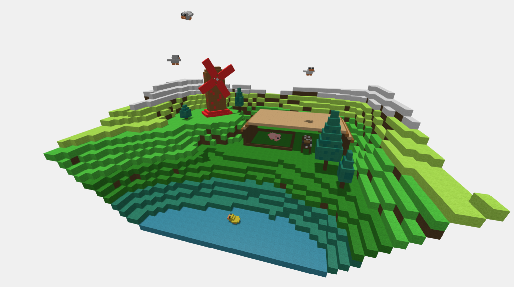
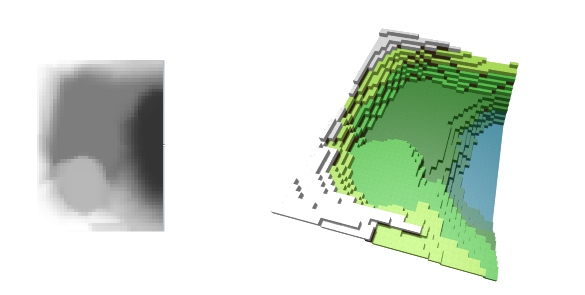
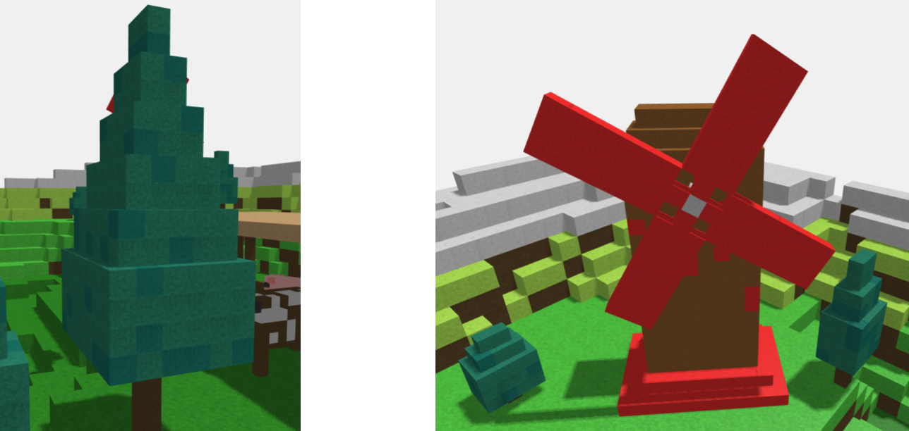
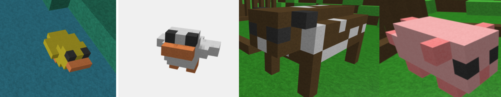

# Interactive 3d Graphics - Primo progetto

## Membri del gruppo

Cussigh Filippo - n°123413

Forgiarini Alessandro - n° 120562

## Descrizione del progetto
Il progetto prevede la realizzazione di una scena interamente modellata tramite cubi e che riprenda lo stile di Minecraft.
Si intende creare la rappresentazione di una campagna, tramite una serie di metodi personalizzabili per la creazione dei vari elementi di scena. La scena visibile mostra dunque una delle possibili implementazioni, ma tutti i suoi elementi sono parametrizzati e predisposti a essere generati in base a dimensioni (in numero di cubi unitari), colori e animazioni a piacere.

Tra le due opzioni disponibili è stata scelta la realizzazione del terreno tramite heightmap.
Sono state inoltre implementate luci ed ombre.

Le animazioni della scena vengono attivate/disabilitate con la barra spaziatrice. La velocità di esse può essere variata premendo i pulsanti freccia destra e sinistra della tastiera.

## Divisione del codice
Il file principale in cui viene creata la scena è StartingCode-withLights.html.
Tutti i metodi realizzati sono stati divisi in relativi file .js in base al loro scopo.
Il foglio di stile della pagina è presente in una cartella separata.
Le texture utilizzate sono raggruppate nella cartella "textures".

## Scena risultante
La scena mostra un paesaggio di campagna costituito da una stalla con animali, diversi alberi, un mulino a vento, degli uccelli in volo e una papera nel laghetto.
Tutti gli oggetti sono stati creati utilizzando cubi di larghezza 1, tuttavia per non aggiungere troppo carico poligonale alcuni elementi sono stati scalati per permettere l'utilizzo di meno cubi.

## Modelli

### Terreno
Il terreno è generato attraverso l'immagine visibile in figura. Il codice permette di caricare un'immagine in scala di grigi di qualunque dimensione. 
Il colore dei cubi viene stabilito in base al valore della heightmap, tuttavia per i cubi fuori dall'acqua è stata fatta la scelta artistica di lasciare color terra i cubi visibili solo lateralmente.

### Edifici e alberi
Sono stati modellati due edifici. La stalla e il mulino. Entrambi sono parametrici su dimensioni (che si traducono in numero di cubi unitari) e colori.
Il mulino è stato creato in modo da permettere la rotazione indipendente delle pale, come visibile.
Gli alberi similmente sono generati a partire dalle dimensioni che vengono passate al metodo, che determinano l'angolo con cui si allarga e stringe la chioma. Inoltre per dare maggiore realismo è previsto il passaggio di due colori e un fattore di varianza, che determina la frequenza di cubi casuali del secondo colore (metodo applicato anche in altri frangenti come il manto della mucca).

### Animali
Sono stati modellati tre animali per dare varietà alla scena.
Dato che non si tratta di modelli geometricamente regolari, in questo caso la struttura di cubi risulta fissa, tuttavia sono possibili diverse personalizzazioni tra cui l'apertura o meno delle ali dell'anatra, o la sporadicità delle macchie della mucca.

## Animazioni
Sono presenti 4 tipi di animazioni diverse:
1. Rotazione di un oggetto su un'orbita circolare attorno ad un asse passato come parametro. L'oggetto viene ruotato in modo che guardi la verso la retta tangente alla sua traiettoria. Per variare il movimento è possible far muovere l'oggetto con moto sinusoidale.
2. Rimbalzo di un oggetto all'interno di un rettangolo. L'oggetto necessita di un vettore direzione di partenza e una velocità. Quando l'oggetto incontra il lato del rettangolo, esso rimbalza con un urto elastico cambiando direzione.
3. Semplice rotazione di un oggetto attorno ad un asse passato come parametro.
4. Movimento di un oggetto su un percorso definito da un insieme di punti. Per variare il movimento è possible far muovere l'oggetto con moto sinusoidale.

Le animazioni create vengono utilizzate per animare questi oggetti:
1. Definire il volo dei tre uccelli in cielo.
2. Muovere il maiale all'interno del recinto.
3. Movimento del sole e delle pale del mulino.
4. Animazione della papera in acqua.

## Costruzione della scena
La scena è stata costruita a partire dal terreno. Il terreno è stato disegnato su GIMP tramite pennelli sfumati per permettere un risultato omogeneo.
I vari oggetti di scena sono stati dunque posizionati in base al terreno scelto per costruire una scena credibile.
Sono state impostate le animazioni per gli animali, il mulino e il sole.
Infine sono stati implementati i comandi per la gestione della velocità delle animazioni.
Alla primo avvio, la velocità del mondo è impostata a 1x.
Viene data la possibilità di selezionare 9 diverse velocità per il mondo, selezionabili tramite la pressione delle frecce destra e sinistra sulla tastiera.